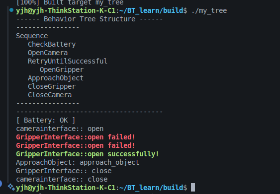

# 参考
https://blog.csdn.net/qq_38429958/article/details/150209931
# 编译运行
***
mkdir build
cd build
cmake ..
make
./my_tree
***

# git 提交
git remote add origin https://github.com/18114447/Behavior_tree_learn.git
git add .

git config --global user.email "3153643511@qq.com"
git config --global user.name "18114447"

git commit -m "Initial commit: Add BT_learn project files"
